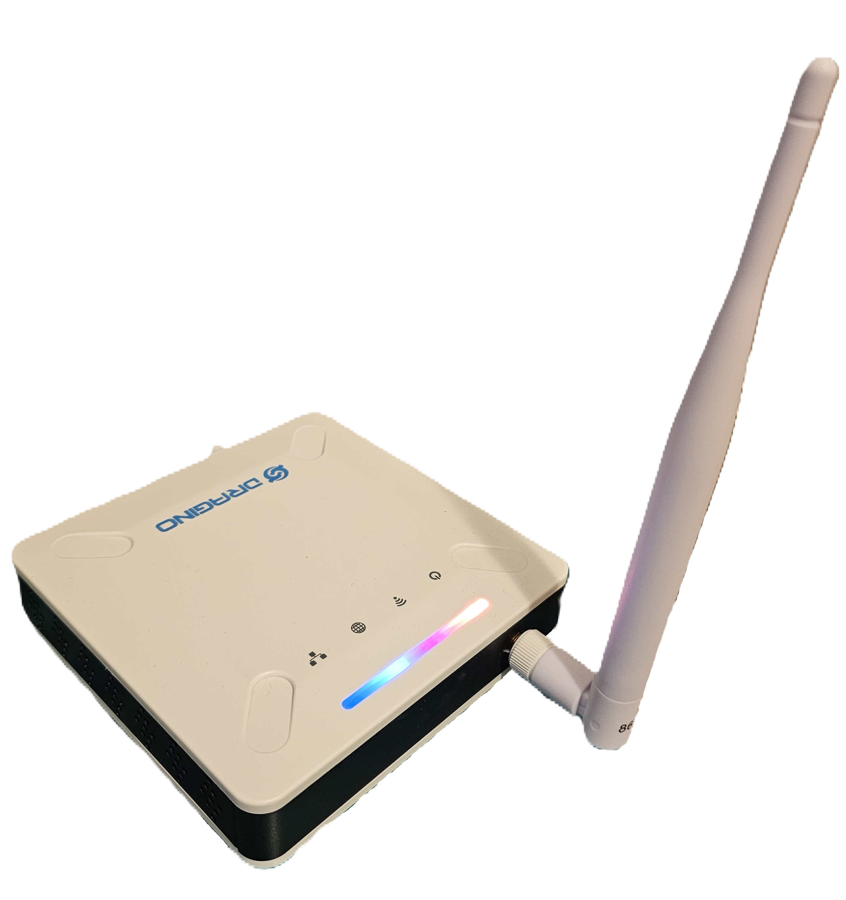
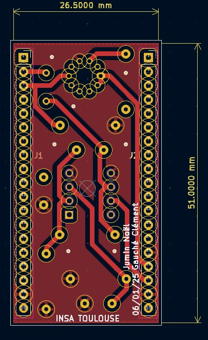
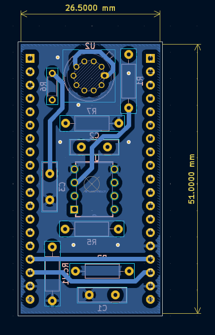
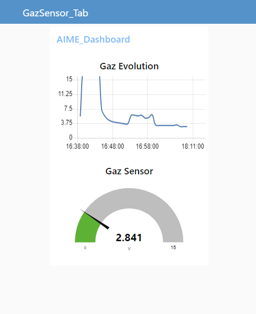

# 2024_2025_GAUCHE_JUMIN
Ce projet fait partie de la formation de l'année 5ISS à l'INSA Toulouse. Nous avons développé un capteur de gaz à nanoparticules à l'AIME, le laboratoire de l'INSA Toulouse. Ensuite, nous avons conçu un PCB et développé un code sur ESP32 pour exploiter ce capteur et afficher ses données sur une interface web.

## SOMMAIRE 
1. [Introduction](#introduction)
2. [LoRa et LoRaWAN](#lora)
3. [The Things Network (TTN)](#the-things-network-ttn)
4. [LTspice](#ltspice)
5. [KiCad](#kicad)
6. [Node-RED](#node-red)
7. [Datasheet](#datasheet)
8. [Améliorations Possibles](#améliorations-possibles)
9. [Contacts](#contacts)

---

## Introduction

Ce projet a permis de développer un système complet pour exploiter un capteur de gaz, comprenant :
- La conception d'un **shield PCB** pour l'ESP32.
- La connexion au réseau **LoRaWAN** à travers **The Things Network (TTN)**.
- La visualisation des données via un tableau de bord interactif sur **Node-RED**.

Le microcontrôleur principal utilisé est un **ESP32** avec un module **LoRa intégré**. Pour simuler le capteur de gaz développé à l'AIME, nous avons également utilisé un capteur industriel **Grove MQ-3B**.

Le contenu de ce dépôt inclut :
- [x] **Code source Arduino** pour collecter les données, les afficher localement, et les envoyer sur TTN.
- [x] Les **fichiers KiCad** du shield PCB, avec le schéma et le modèle final monté.
- [x] Le **flow Node-RED** et le tableau de bord web associé.
- [x] La **datasheet** complète du capteur.

Voici quelques images du produit final :

     
     
    

---

## LoRa & LoRaWAN

LoRa (Long Range) est une technologie de communication sans fil permettant la transmission de données sur de longues distances avec une faible consommation énergétique. 

Dans ce projet, nous commencé par établir une communication en point à point entre 2 modules.

Dans un deuxième temps, nous avons enregistrer le module sur le réseau LoRaWAN de l'INSA, afin de pouvoir envoyer les données de notre capteur de façon sécurisée, et de pouvoir les récupérer via Chirpstack.

A cause d'un problème avec la gateway de l'INSA, nous avons décidé de déployer notre propre gateway LoRa sur le réseau LoRaWAN TTN (The Thing Network).

    

---

## The Things Network (TTN)

TTN est une plateforme qui permet de connecter et de gérer des dispositifs LoRaWAN. Voici les étapes principales de l'intégration avec TTN :
1. Enregistrement de notre capteur ESP32 sur TTN.
2. Visualisation des trames envoyées par le capteur.
3. Récupération des données sur **Node-RED** via le protocole MQTT.

---

## LTspice

Nous avons utilisé **LTspice** pour simuler et dimensionner les composants de l'étage d'adaptation du signal du capteur. Cela garantit une acquisition de données fiable et précise avant leur traitement par le microcontrôleur.

Vous pouvez en apprendre plus en lisant le README dédié la partie simulation.

---

## KiCad

Nous avons conçu le **shield PCB** de l'ESP32 sur **KiCad**, intégrant :
- L'adaptation du signal pour le capteur de gaz.
- Les connecteurs pour une intégration simplifiée.

Voici une vue du shield monté :

     
     

Vous pouvez aller lire le [README](hardware/pcb/README.md) dédié au routage pour plus de détails.

---

## Node-RED

**Node-RED** est une plateforme de programmation par blocs utilisée pour créer des interfaces web. Nous avons développé un tableau de bord pour afficher les données du capteur en temps réel. 

Voici notre tableau de bord :

    

---

## Datasheet

La **datasheet** du capteur développé à l'AIME décrit ses caractéristiques techniques, le procédé de fabrication, et ses spécifications d'utilisation. Elle est disponible dans le répertoire `/datasheet`.

---

## Améliorations Possibles

1. Intégrer davantage de capteurs pour élargir les possibilités de mesure.
2. Optimiser la gestion de l'alimentation du microcontrôleur pour une meilleure autonomie.
3. Développer une application mobile pour contrôler et visualiser les données du capteur.

---

## Contacts

Pour toute question ou suggestion concernant ce projet, vous pouvez nous contacter :

- **Nom :** Clément Gauché & Noël Jumin
- **Email :** clement.gauche@insa-toulouse.fr & noel.jumin@insa-toulouse.fr
- **GitHub :** [@Raspeur](https://github.com/Raspeur/) & [@NoNo47400](https://github.com/NoNo47400/)