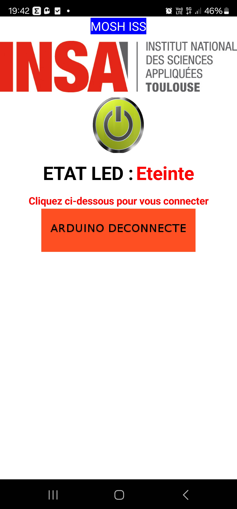

# 2024_2025_GAUCHE_JUMIN
This project is part of the 5ISS program at INSA Toulouse. We developed a nanoparticle-based gas sensor at AIME, the INSA Toulouse laboratory. Then, we designed a PCB and developed ESP32 code to exploit the sensor and display its data on a web interface.

## CONTENTS
1. [Introduction](#introduction)
2. [LoRa and LoRaWAN](#lora)
3. [The Things Network (TTN)](#the-things-network-ttn)
4. [LTspice](#ltspice)
5. [KiCad](#kicad)
6. [Node-RED](#node-red)
7. [AppInventor](#appinventor)
8. [Datasheet](#datasheet)
9. [Possible Improvements](#possible-improvements)
10. [Contacts](#contacts)

---

## Introduction

This project allowed us to develop a complete system for exploiting a gas sensor, including:
- Designing a **shield PCB** for the ESP32.
- Connecting to the **LoRaWAN** network via **The Things Network (TTN)**.
- Visualizing data through an interactive dashboard on **Node-RED**.

The main microcontroller used is an **ESP32** with an integrated **LoRa module**. To simulate the gas sensor developed at AIME, we also used an industrial **Grove MQ-3B sensor**.

This repository contains:
- [x] **Arduino source code** to collect data, display it locally, and send it to TTN.
- [x] The **KiCad files** for the shield PCB, including the schematic and the final assembled model.
- [x] The **Node-RED flow** and its associated web dashboard.
- [x] The complete **datasheet** of the sensor.

Here are some images of the final product:

     
     
    

---

## LoRa & LoRaWAN

LoRa (Long Range) is a wireless communication technology designed to transmit data over long distances with low energy consumption.

In this project, we started by establishing point-to-point communication between two modules.

Later, we registered the module on INSA's LoRaWAN network to securely send our sensor data and retrieve it via ChirpStack.

Due to issues with INSA's gateway, we decided to deploy our own LoRa gateway on The Things Network (TTN).

    

---

## The Things Network (TTN)

TTN is a platform that enables the connection and management of LoRaWAN devices. The main steps in integrating with TTN were:
1. Registering our ESP32 sensor on TTN.
2. Visualizing the frames sent by the sensor.
3. Retrieving the data on **Node-RED** via the MQTT protocol.

---

## LTspice

We used **LTspice** to simulate and size the components of the sensor's signal adaptation stage. This ensured reliable and accurate data acquisition before processing it with the microcontroller.

You can learn more by reading the dedicated [README](hardware/ltspice_simulation/README.md) in the simulation section.

---

## KiCad

We designed the **shield PCB** for the ESP32 on **KiCad**, integrating:
- Signal adaptation for the gas sensor.
- Connectors for simplified integration.

Here is a view of the assembled shield:

     
     

For more details, check the dedicated [README](hardware/pcb/README.md) on routing.

---

## Node-RED

**Node-RED** is a block-based programming platform used to create web interfaces. We developed a dashboard to display real-time sensor data.

Here is our dashboard:

    

---

## Datasheet

The **datasheet** of the gas sensor developed at AIME details its technical characteristics, manufacturing process, and usage specifications. It is available in the [/datasheet](datasheet) directory.

---

## AppInventor

Using **AppInventor**, we designed a mobile application capable of directly communicating with a Bluetooth receiver to turn an LED on or off. You can view the application and its source files in the [/appinventor](appinventor) directory.

    

---

## Possible Improvements

1. Integrate more sensors to expand measurement capabilities.
2. Optimize the power management of the microcontroller for better autonomy.
3. Develop a mobile application to control and visualize the sensor's data.

---

## Contacts

For any questions or suggestions regarding this project, feel free to contact us:

- **Name:** Clément Gauché & Noël Jumin
- **Email:** clement.gauche@insa-toulouse.fr & noel.jumin@insa-toulouse.fr
- **GitHub:** [@Raspeur](https://github.com/Raspeur/) & [@NoNo47400](https://github.com/NoNo47400/)
