# Analog Part

The received signal is in nanoamperes (nA), equivalent to several megaohms (MΩ). Therefore, it must be amplified to be processed by the microcontroller.

---

## Transient Analysis

The input signal to the amplifier is between:

$$
50 \, \text{nA} \times 100 \, \text{k} (\text{R2}) = 5 \, \text{mV}
$$

$$
100 \, \text{nA} \times 100 \, \text{k} = 10 \, \text{mV}
$$

At the amplifier's output, the signal is multiplied by 100, resulting in a signal between $500 \, \text{mV} \, \text{and} \, 1 \, \text{V}$.

    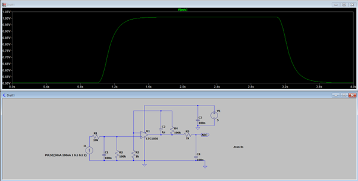

---

## Frequency Analysis

    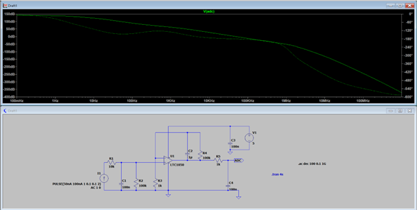

The gain observed is between 140 and 150 dB, which is extremely high.

$$
H = \frac{V_{\text{out}}}{V_{\text{in}}} = 10^{\frac{140}{20}} = 10^7 = \frac{0.5}{50 \times 10^{-9}}
$$

This confirms a consistent gain.

---

### Filter Gains Verification
We are now verifying every filters. We start by the one on the right, which the simplest.
#### First Filter (Right Side - Simplest)

This filter only introduces an equivalent resistance:

    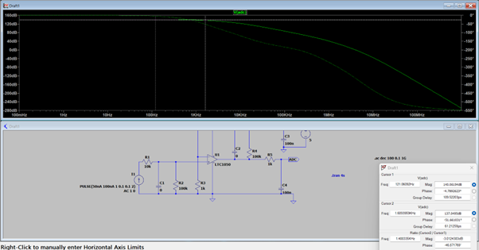

#### Second filter (Middle Stage)
We are now analyzing the right filter, which only introduces an equivalent resistance:

    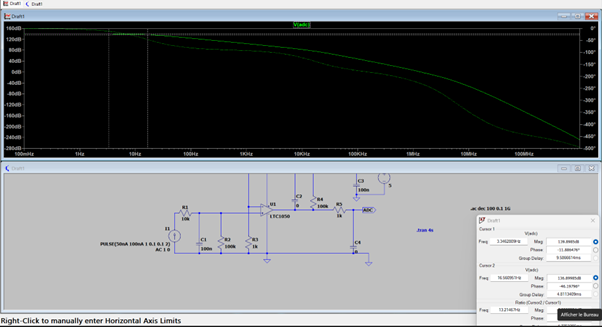

#### Third filter (Left Stage)

    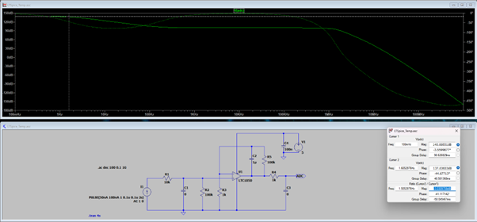

### Frequency Cutoff Table

| Stage               | Theoretical $f_c$ | Simulated $f_c $ |
|---------------------|-----------------------|---------------------|
| 1: Left Stage       | $\frac{1}{2\pi R1(C1 \parallel R2)} = 16 \, \text{Hz} $ | 16.5 Hz |
| 2: Middle Stage     | 1.6 Hz               | 1.6 Hz              |
| 3: Right Stage      | $ \frac{1}{2\pi R5C4} = 1591.55 \, \text{Hz} $ | 1.6 kHz |

---

### Attenuation Analysis

#### At 50 Hz :

The attenuation is: $140 \, \text{dB} - 100 \, \text{dB} = 40 \, \text{dB}$

    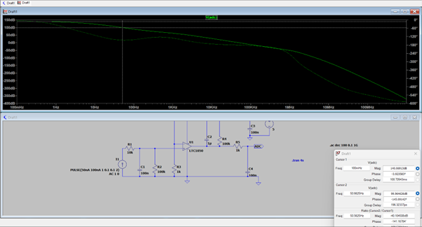

#### At Nyquist Frequency ($f_N = 7.5 \, \text{kHz} $):

The attenuation is: $ 140 \, \text{dB} - 30 \, \text{dB} = 110 \, \text{dB}$

    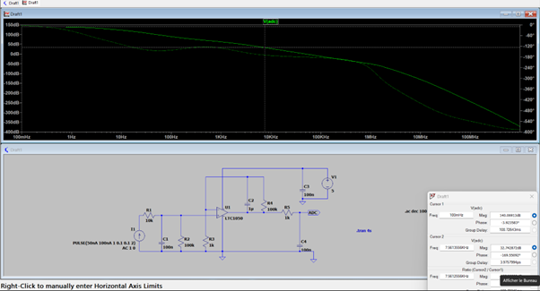

---

## Arduino Microcontroller Information

For an Arduino-like microcontroller:

- **ADC:** 200 kHz
- **AVR:** 10 bits (effectively 13 bits due to stop bits)

Effective frequency:

$$
\frac{200 \, \text{kHz}}{13 \, \text{bits}} = 15 \, \text{kHz}
$$

To comply with Nyquist's theorem, the maximum sampling frequency is:

$$
\frac{15 \, \text{kHz}}{2} = 7.5 \, \text{kHz}
$$

---

## Sensor Simulation with LTSpice

To simulate the sensor accurately, we modeled its components using the following current evolution equation:

$$
I = V(C_p, C_n) \times (10 \, \text{nS} + V(G_c, G_n) \times 10 \, \text{nS})
$$

This is derived from the general formula $ I = GV $, where $ G $ represents conductance. Parameters include:

- $ t_0: V(G_c, G_n) = 0 $
- $ t_1: V(G_c, G_n) = 1 $
- And we take $ V(C_p, C_n) = 5 \, \text{V} $

Thus:

$$
A_0 = I = 5 \times 10 \, \text{nS} = 50 \, \text{nA}
$$

$$
A_1 = I = 5 \times (10 \, \text{nS} + 10 \, \text{nS}) = 100 \, \text{nA}
$$

### Sensor Schematic
Here is our sensor schematic :

    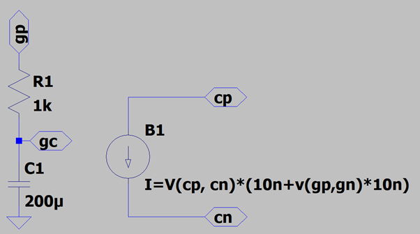

---

### Simulation Results

Simulations confirm that the sensor's signal is properly amplified :

    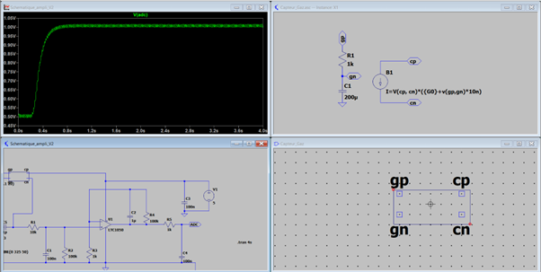

The FFT also reveals artificially added noise simulating the electrical grid.

    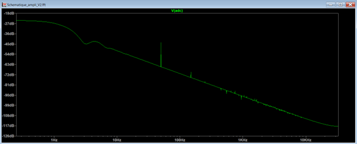

We can remove the part in red, which is emulating the noise:

    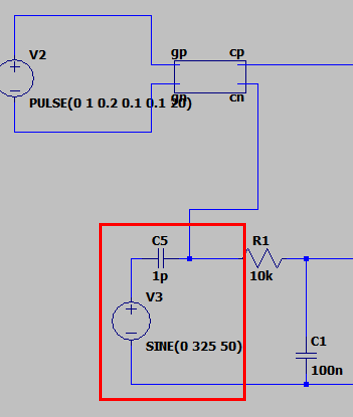

---

### Noise Reduction

To reduce noise, capacitors can be adjusted. For instance, increasing a capacitor's value significantly improves noise filtering.

    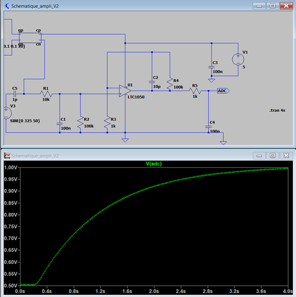

---

## Sensor Functionality and Adaptation

The sensor operates with a resistance variation $ \Delta R / R $. Since $ R $ depends on the gas exposure, the circuit components must adapt dynamically. Simplifications include:

1. Operating at very low frequencies to eliminate capacitances.
2. Analyzing the entire system to ensure consistent operation under varying conditions.

## Conclusion

The design, simulation, and optimization of the analog part ensure:

- Proper amplification of low current signals.
- Effective noise reduction.
- Accurate gas detection under varying conditions.

This concludes the analog part's analysis and development.
